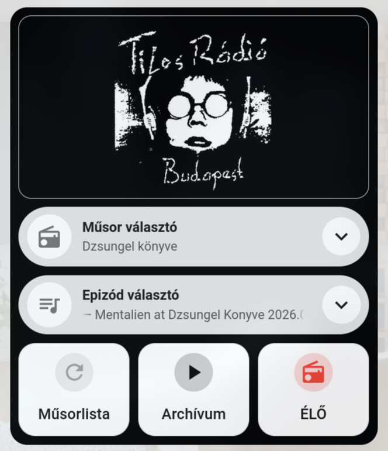

# Tilos Radio Player (Home Assistant custom component)

A Tilos Rádió archívumából közvetlen lejátszás a Home Assistantban a megadott media player entitáson keresztül.

## Fícsörök
- Műsor választás az összes archivált adásból (zenei a lista elején, beszélgetősek a végén ABC sorrendben)
- Epizód választás cím alapján az utolsó 4 hónapból
- Lejátszás közvetlenül az archívumból, az élő műsort is lehet hallgatni.
- HACS-ból is telepíthető, egyedi integrációként, így később tud frissülni.
- BETA: Műsor meta adatok megjelenítése (epizód cím, műsor név, és a műsor borítója)

## Villantás


## Hozd magaddal
Bubble Card-ot érdemes feltenni a HACS-ból, mert szép legörülőket tud prezentálni, a villantós képen is azzal látszik. Nélküle is megy, de úgy meh...

## Felpattintás
### HACS-al
- A HACS legyen feltelepítve
- Oldalsó sávban: HACS, jobbra fent 3 pötty majd: Egyedi repók
- A felbukkanó ablakban: 
  - Repó megnyitása: `droM4X/ha-tilos-player`
  - Típus: `Integráció`
- Hozzáadás után HA újraindítása
- Új integráció hozzáadása, Tilos Radio Player. A lejátszó entitást kell beállítani.
- A kártya beállítása (kód alább)
- Műsorlista frissítése (újraindításkor és 12 óránként lefut), műsor választás, lejátszás.
- Örvendezés a remek muzsikáknak :)

### Manuálisan
- Repo klónozása/letöltése
- A HA könyvtárába a custom_components mappa bemásolása.
- HA újraindítása
- Új integráció hozzáadása, Tilos Radio Player. A lejátszó entitást kell beállítani.
- A kártya beállítása (kód alább)
- Műsorlista frissítése (újraindításkor és 12 óránként lefut), műsor választás, lejátszás.
- Örvendezés a remek muzsikáknak :)

## 🂡 Pikk Ász
A kártya yaml fájlja alant, kézi hozzáadás.

```
type: vertical-stack
cards:
  - type: picture
    image: /api/brands/integration/tilos_player/logo.png
    tap_action:
      action: none
    hold_action:
      action: none
  - type: custom:bubble-card
    card_type: select
    entity: select.tilos_radio_show
    name: Műsor választó
    icon: mdi:radio
    icon_color: grey
    show_state: true
  - type: custom:bubble-card
    card_type: select
    entity: select.tilos_radio_episode
    name: Epizód választó
    icon: mdi:playlist-music
    icon_color: grey
    show_state: true
  - type: horizontal-stack
    cards:
      - type: custom:mushroom-template-card
        entity: button.tilos_radio_reload_shows
        primary: Műsorlista
        icon: mdi:refresh
        tap_action:
          action: perform-action
          perform_action: button.press
          target:
            entity_id: button.tilos_radio_reload_shows
        color: grey
        features_position: bottom
        vertical: true
        card_mod:
          style: |
            ha-card {
              border-radius: 16px;
              
              opacity: 0.4;
              
            }
      - type: custom:mushroom-template-card
        entity: button.tilos_radio_play
        primary: Lejátszás
        icon: mdi:play
        tap_action:
          action: perform-action
          perform_action: button.press
          target:
            entity_id: button.tilos_radio_play
        color: black
        features_position: bottom
        vertical: true
        card_mod:
          style: |
            ha-card {
              border-radius: 16px;
              
              opacity: 0.4;
              pointer-events: none;
              
            }
      - type: custom:mushroom-template-card
        entity: button.tilos_radio_live
        primary: ÉLŐ
        icon: mdi:radio
        tap_action:
          action: perform-action
          perform_action: button.press
          target:
            entity_id: button.tilos_radio_live
        color: red
        features_position: bottom
        vertical: true
        card_mod:
          style: |
            ha-card {
              border-radius: 16px;
            }

```
> [!TIP]
> A szakasz színének feketére állításával lehet elérni a fenti kinézetet. Ezt utólag kell beállítani az adott szakaszra ahol a kártya van. Szakasz szerkesztése, háttér szín fekete, átlátszóság 100%.

<small>Disclaimer: Csak egy lelkes hallgatói megoldás, semmilyen kapcsolatban nem voltam/vagyok a rádióval, nem volt semmi ráhatásuk erre a projectre. Természetesen nagy nyelvi modellel (ami továbbra sem ai) készült, GLM 5.3 Flash volt az elkövető. Korábban összeraktam ezt sh scriptekkel és egyéb patkolásokkal, ez az átírat arra alapul, hogy könnyebben megosztható legyen.</small>
