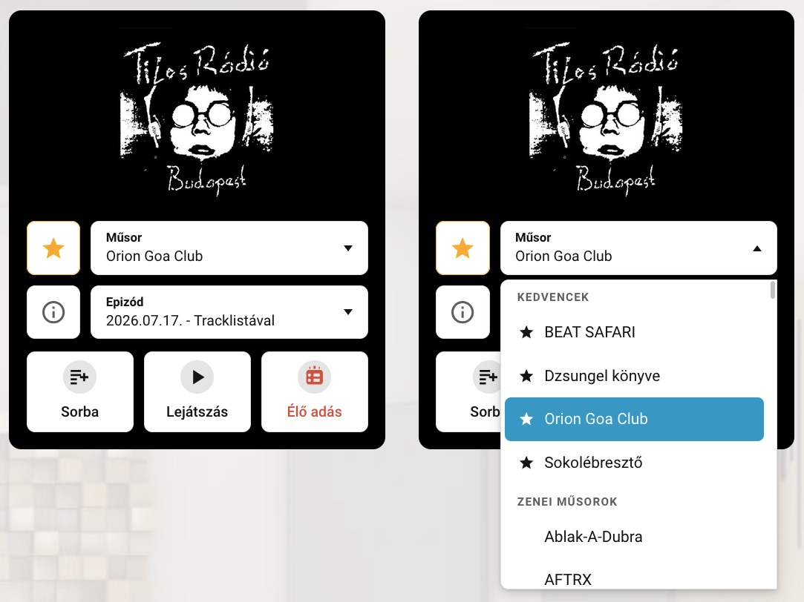
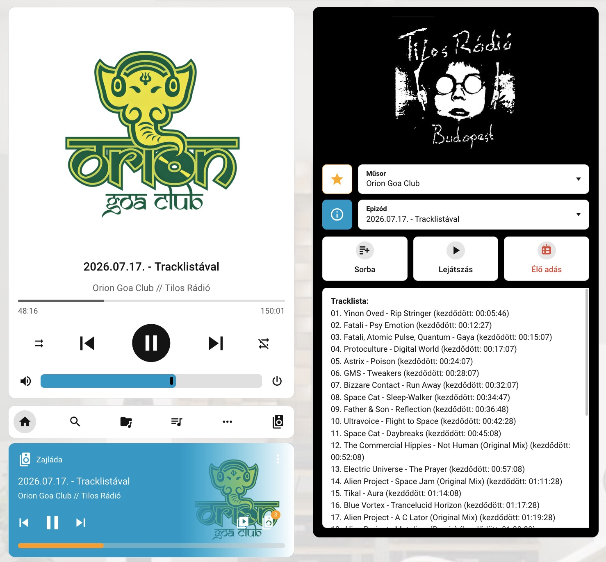

# Tilos Radio Player (Home Assistant custom component)


A Tilos Rádió archívumából közvetlen lejátszás a Home Assistantban a megadott media player entitáson keresztül, saját kártyával.

## Fícsörök
- Műsor választás az összes archivált adásból (kedvencek elöl, majd zenei és beszélgetős műsorok csoportban ABC sorrendben) + élő műsor
- Kedvenc műsorok csillagozása a kártya bal felső sarkából, a műsorlista elejére kerülnek
- Műsorleírás megjelenítése (műsor infó gomb) és epizód műsorleírás / tracklista megjelenítése
- Közvetlen mp3 link lejátszása (opcionális)
- Lejátszó lista támogatása (csak Music Assistant esetén)
- HACS-ból is telepíthető, egyedi integrációként, így később tud frissülni.
- Saját Lovelace kártya vizuális (interaktív) szerkesztővel és YAML móddal.

## Villantás
#### A kártya


#### Irányítópulton beállítva, különböző média lejátszókon



## Felpattintás
### HACS-al
- A HACS legyen feltelepítve
- Oldalsó sávban: HACS, jobbra fent 3 pötty majd: Egyedi repók
- A felbukkanó ablakban: 
  - Repó megnyitása: `droM4X/ha-tilos-player`
  - Típus: `Integráció`
- Hozzáadás után HA újraindítása

### Manuálisan
- Repo klónozása/letöltése
- A HA könyvtárába a custom_components mappa bemásolása
- HA újraindítása

## Bekonfig
- Új integráció hozzáadása, Tilos Radio Player. A lejátszó entitást kell beállítani.
- A felületen kártya hozzáadása: Tilos Player Card
- A kártya beállításainál (vizuális szerkesztő vagy YAML) az alábbiakat lehet megadni:
  - **Integráció típusa**: Home Assistant vagy Music Assistant
  - **Média lejátszó entitás**: ezen a lejátszón futnak a kártya gombjai
  - **Link lejátszó**: közvetlen mp3 lejátszás vagy várólistára adás linkről
- A műsorlista induláskor és 12 óránként automatikusan frissül.
- Műsor választás, lejátszás.
- Örvendezés a remek muzsikáknak :)

### Minimális kézi config
```
type: custom:tilos-player-card
media_player: media_player.lejatszo   # a lejátszásra használt media_player entitás
integration_type: home_assistant      # integráció típusa (opciók: home_assistant|music_assistant)
link_player: false                    # link lejátszó megjelenítése (opciók: true|false)
```

---
<small>Disclaimer: Csak egy lelkes hallgatói megoldás, semmilyen kapcsolatban nem voltam/vagyok a rádióval, nem volt semmi ráhatásuk erre a projectre. Természetesen nagy nyelvi modellekkel (ami továbbra sem ai) készült (DS 4.1 Flash, GPT 5.6 Luna, GLM 5.3 Flash). Korábban összeraktam ezt sh scriptekkel és egyéb patkolásokkal, ez az átírat arra alapul, hogy könnyebben megosztható legyen.</small>
