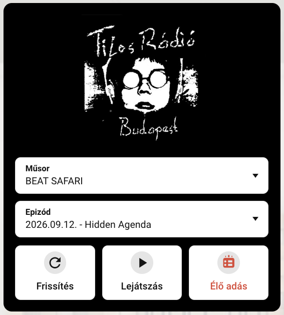

# Tilos Radio Player (Home Assistant custom component)

A Tilos Rádió archívumából közvetlen lejátszás a Home Assistantban a megadott media player entitáson keresztül, saját kártyával.

## Fícsörök
- Műsor választás az összes archivált adásból (zenei a lista elején, beszélgetősek a végén ABC sorrendben)
- Epizód választás cím alapján az utolsó 4 hónapból
- Lejátszás közvetlenül az archívumból, az élő műsort is lehet hallgatni.
- HACS-ból is telepíthető, egyedi integrációként, így később tud frissülni.
- Saját Lovelace kártya, pár kattintással beállítható.
- BETA: Műsor meta adatok megjelenítése (epizód cím, műsor név, és a műsor borítója)

## Villantás
#### A kártya

#### Irányítópulton beállítva, különböző média lejátszókon

## Felpattintás
### HACS-al
- A HACS legyen feltelepítve
- Oldalsó sávban: HACS, jobbra fent 3 pötty majd: Egyedi repók
- A felbukkanó ablakban: 
  - Repó megnyitása: `droM4X/ha-tilos-player`
  - Típus: `Integráció`
- Hozzáadás után HA újraindítása
- Új integráció hozzáadása, Tilos Radio Player. A lejátszó entitást kell beállítani.
- A felületen kártya hozzáadása: Tilos Player Card
- Műsorlista frissítése (újraindításkor és 12 óránként lefut), műsor választás, lejátszás.
- Örvendezés a remek muzsikáknak :)

### Manuálisan
- Repo klónozása/letöltése
- A HA könyvtárába a custom_components mappa bemásolása.
- HA újraindítása
- Új integráció hozzáadása, Tilos Radio Player. A lejátszó entitást kell beállítani.
- A felületen kártya hozzáadása: Tilos Player Card.
- Műsorlista frissítése (újraindításkor és 12 óránként lefut), műsor választás, lejátszás.
- Örvendezés a remek muzsikáknak :)

<small>Disclaimer: Csak egy lelkes hallgatói megoldás, semmilyen kapcsolatban nem voltam/vagyok a rádióval, nem volt semmi ráhatásuk erre a projectre. Természetesen nagy nyelvi modellel (ami továbbra sem ai) készült, GLM 5.3 Flash és GPT 5.6 Luna volt az elkövető. Korábban összeraktam ezt sh scriptekkel és egyéb patkolásokkal, ez az átírat arra alapul, hogy könnyebben megosztható legyen.</small>
